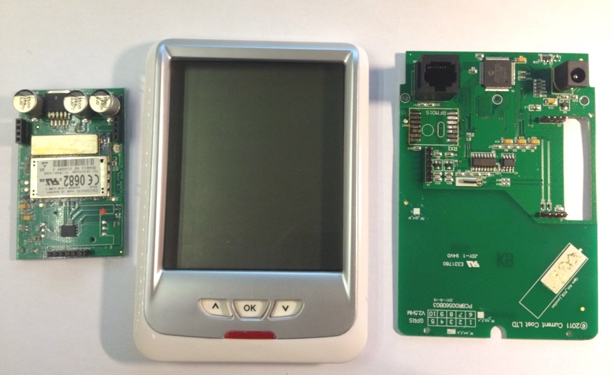
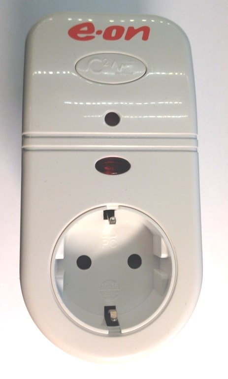
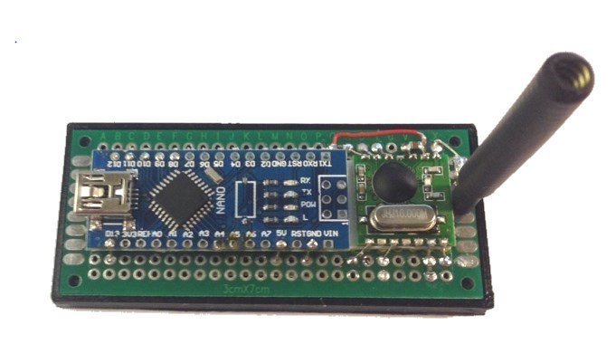

# arduino_100koll
Arduino based receiver for 100koll power meters or "IAM Transmitter only" based.

Based on information from https://github.com/JackKelly/rfm_edf_ecomanager/wiki/Technical-details-of-Current-Cost-RF-protocol
and logic probing on 100koll LCD unit.

I have reused the RFM01 from the LCD unit.
Output is one-line JSON format. Timestamp is number of milliseconds since start.
Suitable for Node-red serial port.

# RFM01
The RFM01 can work on 5v directly.

#Pinout
* RFM RESET - Arduino 8
* RFM NFFS  - Arduino 9
* RFM NSET  - Arduino 10
* RFM FFIT - Arduino 12
* RFM SDI  - Arduino 11
* RFM SCK  - Arduino 13

10k pull-up on RESET and NSET.

# Pairing
No need to pairing, arduino will output all devices found.
The pairing accually change the sensor address.
